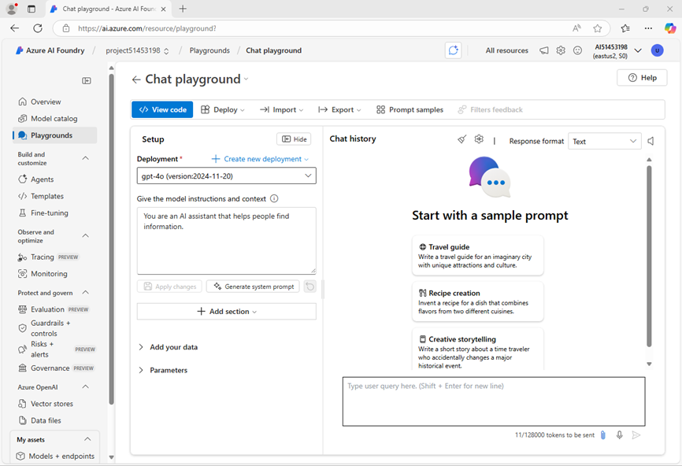
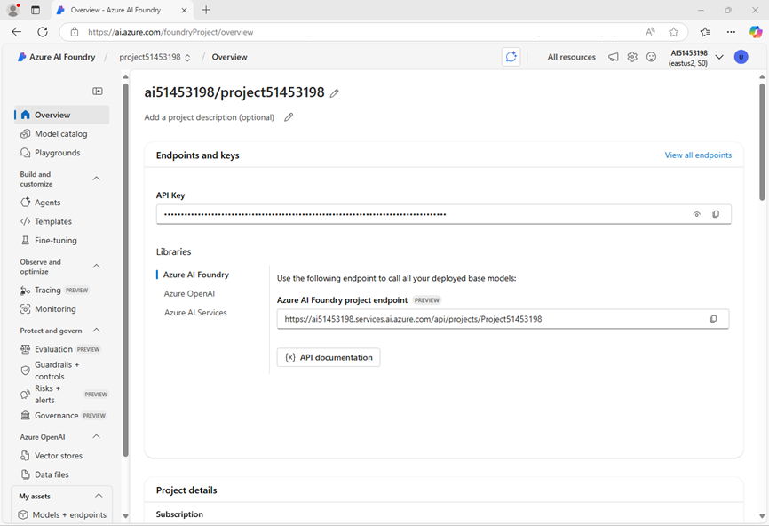
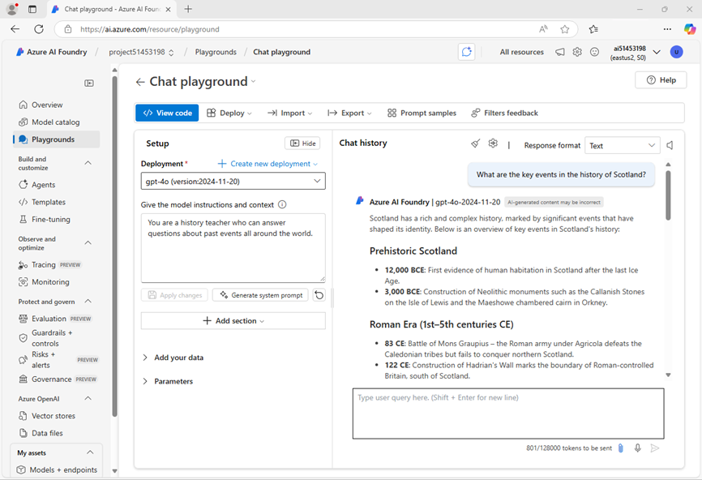

---
lab:
  title: AI 開発プロジェクトの準備
  description: 開発者が AI ソリューションの構築に成功するように、Azure AI Foundry プロジェクトのクラウド リソースを整理する方法について説明します。
---

# AI 開発プロジェクトの準備

この演習では、Azure AI Foundry ポータルを使用してプロジェクトを作成し、AI ソリューションを構築する準備を整えます。

この演習は約 **30** 分かかります。

> **注**: この演習で使用されるテクノロジの一部は、プレビューの段階または開発中の段階です。 予期しない動作、警告、またはエラーが発生する場合があります。

## Azure AI Foundry ポータルを開く

まず、Azure AI Foundry ポータルにサインインしましょう。

1. Web ブラウザーで [Azure AI Foundry ポータル](https://ai.azure.com) (`https://ai.azure.com`) を開き、右上の **サインイン** ボタンか **開始するにはサインインしてください** のボタンをクリックして、講師より配布された資格情報を使用してサインインします。
    初めてサインインするとき、ヒントまたはクイック スタート ウィンドウが表示されますが使用しないため閉じます。

    

## プロジェクトの作成

Azure AI プロジェクトを作成することで、AI開発のためのワークスペースが使用できるようになります。 まずは使用するモデルを選択し、プロジェクトを作成しましょう。

> **注**: AI Foundry プロジェクトは *Azure AI Foundry* リソースをベースにすることができます。このリソースが、AI モデル (Azure OpenAI を含む)、Azure AI サービス、AI エージェントやチャット ソリューションを開発するためのその他のリソースへのアクセスを提供します。 または、*AI ハブ* リソースに基づいてプロジェクトを作成することもできます。このリソースには、セキュリティで保護されたストレージ、コンピューティング、専用のツールに使用する Azure リソースへの接続が含まれます。 Azure AI Foundry ベースのプロジェクトは、AI エージェントまたはチャット アプリ開発のリソースの管理を希望する開発者に最適です。 複雑な AI ソリューションに取り組むエンタープライズ開発チームには、AI ハブ ベースのプロジェクトの方が適しています。

1. 先ほどのログイン後に移動するページにある **[モデルと機能を探す]** セクションで、プロジェクトで使用する `gpt-4o` モデルを検索します。 **検索ボックス** に使用したいモデル名を入力することで検索可能です。

1. 検索結果で **gpt-4o** モデルを選んで詳細を確認してから、モデルのページの上部にある **[このモデルを使用する]** を選択します。

1. プロジェクトの作成を求められたら、プロジェクトの名称は自動入力された内容を使用し、 **[高度なオプション]** を展開します。

1. **[カスタマイズ]** を選択し、プロジェクトに次の設定を指定します。
    - **Azure AI Foundry リソース**: 自動入力された内容を使用
    - **サブスクリプション**: ドロップダウンリストから選択可能なサブスクリプションを選択
    - **リソース グループ**: ドロップダウンリストから選択可能なリソースグループを選択
    - **リージョン**: **East US**

    > 一部の Azure AI リソースは、リージョンのモデル クォータによって制限されます。 演習の後半でクォータ制限を超えた場合は、別のリージョンに別のリソースを作成する必要が生じる可能性があります。

1. **[作成]** をクリックして、プロジェクトが作成されるまで待ちます。 作成が完了するとモデルの展開画面が表示されます。 **デプロイ名** はデフォルトのもの（モデル名そのまま）を使用し、**デプロイの種類** は **[グローバル標準]** を選択します。デプロイの詳細から **カスタマイズ** を展開して、**[1 分あたりのトークン数レート制限]** として **5K** を設定します。設定が完了したら **[デプロイ]** ボタンをクリックして

1. モデルの作成が完了したら、モデルをテストするためにチャットプレイグラウンドを開きます。自動的に遷移する場合もありますが、遷移しない場合は **[プレイグラウンドで開く]** ボタンからプレイグランドを開きます。
    プレイグラウンドではチャットインターフェースを使用してモデルの動作テストやパラメーターテストを行うことができます。

    

1. 左側のナビゲーション ウィンドウで **[概要]** を選択すると、プロジェクトのメイン ページが表示されます。
    概要ページではエンドポイントやAPIキーを確認、取得することが可能です。

    

1. 左のナビゲーション ウィンドウの下部で **[管理センター]** を選択します。 管理センターでは、リソースレベルとプロジェクトレベルの両方で設定を構成できます。これらはどちらもナビゲーション ウィンドウに表示されます。

    ![Azure AI Foundry ポータルの [管理センター] ページのスクリーンショット。](./media/ai-foundry-management.png)

    *リソース* レベルは、プロジェクトをサポートするために作成された **Azure AI Foundry** リソースに関連します。 このリソースには、Azure AI サービス モデルと Azure AI Foundry モデルへの接続が含まれます。AI 開発プロジェクトへのユーザー アクセスを一元的に管理するため場所となります。

    *プロジェクト* レベルは個々のプロジェクトに関連します。プロジェクトでプロジェクト固有のリソースを追加および管理できます。

1. 画面右側にある **リソースのプロパティ** から **リソース グループ** へのリンクを選択して新しいブラウザー タブを開き、Azure portal に移動します。 メッセージに応じて、Azure の資格情報でサインインします。MFAが求められた場合は、Microsoft Authenticatorを使用して多要素認証を実施します。

1. Azure portal でリソース グループを表示して、Azure AI Foundry リソースとプロジェクトをサポートするために作成された Azure リソースを確認します。

    

    なお、リソースは、プロジェクトの作成時に選択したリージョンに作成されています。

1. [Azure portal] タブを閉じて、Azure AI Foundry ポータルに戻ります。

## プロジェクト エンドポイントを確認する

Azure AI Foundry プロジェクトには、クライアント アプリケーションからプロジェクトやそれに含まれるモデルおよび AI サービスへの接続に使用できる エンドポイント が、多数含まれています。

1. [管理センター] ページのナビゲーション ウィンドウで、 **[プロジェクトへ移動(Go to project)]** をクリックします。
1. プロジェクトの **[概要]** ページで、**[エンドポイントとキー]** セクションを表示します。ここには、以下のようなAIモデルに対してアプリケーション内のコードでアクセスに使用できるエンドポイントと承認キーが表示されます。
    - Azure AI Foundry プロジェクトとそこにデプロイされたモデル
    - Azure AI Foundry モデルの Azure OpenAI
    - Azure AI サービス

## 生成 AI モデルをテストする

ここまではAzure AI Foundry プロジェクトの構成について確認してきました。ここからはチャットプレイグラウンドに移動してデプロイしたモデルを確認します。

1. プロジェクトの左側にあるナビゲーション ウィンドウで、**[プレイグラウンド]** を選択します。 
1. **[チャット プレイグラウンド]** を開き、先ほど展開した **gpt-4o** モデルがセットアップペイン内の **[デプロイ]** セクションで選択されていることを確認します。
1. **[セットアップ]** ペインの **[モデルに指示とコンテキストを与える]** ボックスに、次の指示を入力します。

   ```
   あなたは世界の歴史に関する専門家であり、歴史上の出来事に関する質問に答えるアシスタントです。自分の専門外の内容には回答しないでください。
   ```

1. テキストボックス下部にある **変更を適用** をクリックしてしてシステム メッセージの更新を適用します。
1. チャット ウィンドウで、「`日本の歴史における重要な出来事にはどのようなものがありますか？`」などのプロンプトを入力し、応答を確認します。

    

1. 応答が返されるはずです。今度は「`太陽系における最も質量が大きい惑星はなんですか？`」など歴史学に関係しないプロンプトを入力し、応答を確認します。

1. 今度は回答できない旨の応答が返されるはずです。このようにシステムメッセージやパラメーターの動きをプレイグラウンドでは検証することができます。

## まとめ

この演習では、Azure AI Foundry について調べ、プロジェクトとその関連リソースを作成および管理する方法について確認しました。
