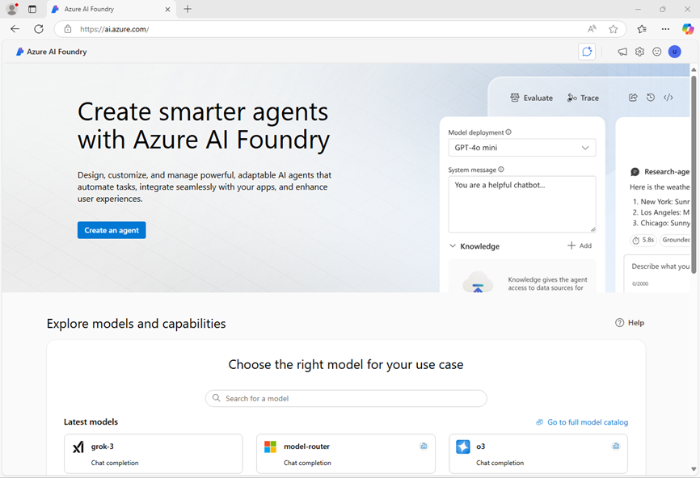
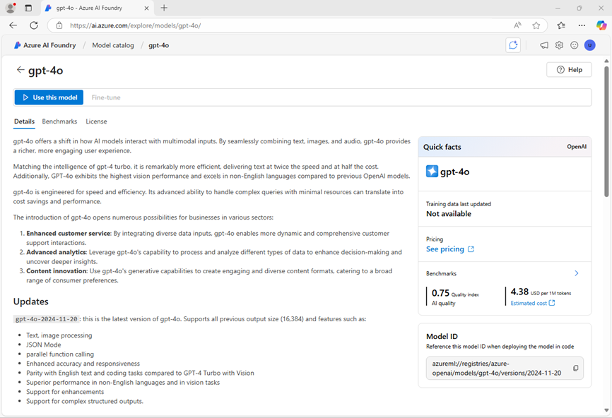
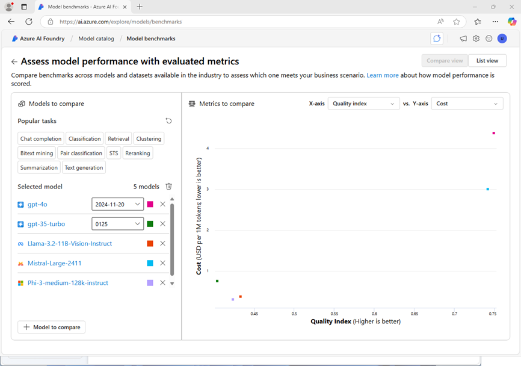
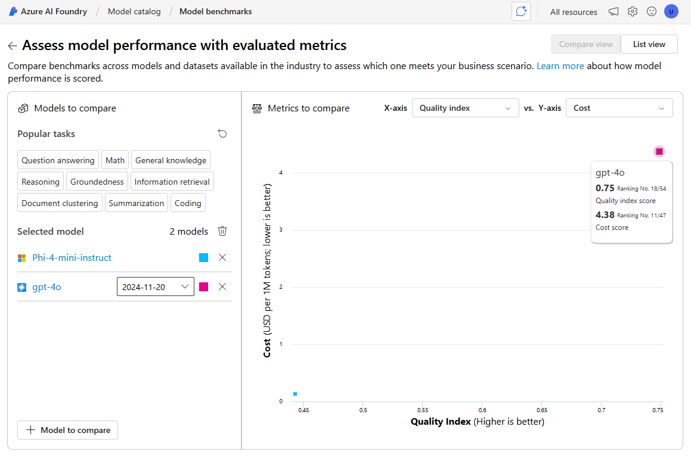

---
lab:
  title: 言語モデルを選択してデプロイする
  description: 生成 AI アプリケーションは、1 つ以上の言語モデルに基づいて構築されます。 自分の生成 AI プロジェクトに適したモデルを見つけて選択する方法について説明します。
---

# 言語モデルを選択してデプロイする

Microsoft Foundry のモデル カタログは、さまざまなモデルを探索してから使用できる中央リポジトリとして機能し、生成 AI シナリオの作成を容易にします。

この演習では、Foundry ポータルでモデル カタログを調べて、問題の解決に役立つ生成 AI アプリケーションに使用できる可能性のあるモデルを比較します。

この演習には、約 **25** 分かかります。

> **注**: この演習で使用されるテクノロジの一部は、プレビューの段階または開発中の段階です。 予期しない動作、警告、またはエラーが発生する場合があります。

## モデルを調査する

まず、Foundry ポータルにサインインし、使用可能なモデルをいくつか調べてみましょう。

1. Web ブラウザーで、[Foundry ポータル](https://ai.azure.com) (`https://ai.azure.com`) を開き、Azure 資格情報を使用してサインインします。 初めてサインインする場合に開かれるヒントまたはクイック スタートのペインを閉じ、必要に応じて、左上にある **[Foundry]** ロゴを使用してホーム ページに移動します。次の図のようなページが表示されます (**[ヘルプ]** ペインが表示される場合は閉じます)。

    

1. ホーム ページの情報を確認します。
1. ホーム ページの **[モデルと機能を探す]** セクションで、プロジェクトで使用する `gpt-4o` モデルを検索します。
1. 検索結果で **gpt-4o** モデルを選んで、その詳細を表示します。
1. 説明を読み、**[詳細]** タブで入手できるその他の情報を確認します。

    

1. **GPT-4o** ページで、**[ベンチマーク]** タブを表示して、一部の標準パフォーマンス ベンチマークと同様のシナリオで使用されている他のモデルとの比較を確認します。

    ![GPT-4o の [モデル ベンチマーク] ページのスクリーンショット。](./media/gpt4-benchmarks.png)

1. **GPT-4o** ページ タイトルの横にある戻る矢印 (**&larr;**) を使用して、モデル カタログに戻ります。
1. `Phi-4-reasoning` を検索し、**Phi-4-reasoning** モデルの詳細とベンチマークを表示します。

## モデルの比較

2 つの異なるモデルを確認しました。どちらも、生成 AI チャット アプリケーションの実装に使用できます。 次に、これら 2 つのモデルのメトリックを視覚的に比較してみましょう。

1. 戻る矢印 (**&larr;**) を使用して、モデル カタログに戻ります。

1. **[モデルの比較]** を選択します。 モデル比較用のビジュアル チャートが、一般的なモデルの選択と共に表示されます。

    

1. **[比較するモデル]** ウィンドウで、*質問応答*などの一般的なタスクを選んで、特定のタスクで一般的に使用されるモデルを自動的に選択できることに注意してください。

1. **[すべてのモデルをクリア]**  アイコン（ゴミ箱状のアイコン）を使用して、自動的に選択されたすべてのモデルを削除します。

1. **[+ 比較するモデル]** ボタンを使用して、**GPT-4o** モデルを検索して **[確認]** ボタンをクリックして一覧に追加します。 同様に **Phi-4-reasoning** モデルも一覧に追加します。

1. **品質インデックス** (モデルの品質を示す標準化されたスコア) と**コスト**に基づいてモデルを比較しているチャートを確認します。 チャート内でモデルを表すポイントの上にマウスを合わせると、モデルの特定の値を確認できます。

    

1. **X 軸**ドロップダウン メニューの **[品質]** で、次のメトリックを選択し、結果の各グラフを観察してから次に切り替えます。
    - 精度
    - 品質インデックス

    ベンチマークによれば、Phi-4-reasoning モデルは全体的なパフォーマンスが高く、コストも低いように見えます。

## GPT-4o モデルとチャットする

GPT-4oは以前のラボでデプロイしています。もう一度プレイグラウンドを使用してテストを実施します。

1. 画面左上に表示される **[Microsoft Foundry]** のロゴをクリックして、 **[Microsoft Foundryでの構築を続ける]** セクションに表示されているリソース名のリンクをクリックします。
1. チャット プレイグラウンドへ移動し、 **[セットアップ]** ウィンドウで**gpt-4o** モデルが選択されていることを確認します。**[モデルに指示とコンテキストを与える]** フィールドで、システム プロンプトを `あなたは問題解決を支援するAIアシスタントです。` に設定します。
1. **[変更の適用]** を選択して、システム プロンプトを更新します。

1. チャット ウィンドウに次のクエリを入力します

   ```
   狐と鶏と穀物の袋を、舟で川を渡さなければなりません。一度に運べるのは一つだけです。鶏と穀物を一緒に置いておくと、鶏が穀物を食べてしまいます。狐と鶏を一緒に置いておくと、狐が鶏を食べてしまいます。三つ全てを、何も食べられずに川を渡すにはどうすればよいでしょうか？
   ```

1. 応答を表示します。 それから、次のフォローアップ クエリを入力します。

   ```
   その理由を説明してください。
   ```

## 別のモデルをデプロイする

異なるモデルでどのように応答が変化するのかをプレイグラウンドで確認するために、 **Phi-4-reasoning** モデルもデプロイしてみましょう。

1. 左側のナビゲーション バーの **[マイ アセット]** セクションで、**[モデル + エンドポイント]** を選択します。
1. **[モデル デプロイ]** タブの **[+ モデルのデプロイ]** ドロップダウン リストで、**[基本モデルをデプロイする]** を選択します。 次に、`Phi-4-reasoning` を検索して選択を確認します。
1. モデル ライセンスに同意して続行します。
1. 次の設定で **Phi-4-reasoning** モデルをデプロイします。
    - **デプロイ名**: **既定値を使用**
    - **デプロイの種類**: グローバル標準
    - **デプロイの詳細**: **既定値を使用**

1. **[デプロイ]** ボタンをクリックしてデプロイが完了するまで待ちます。

## *Phi-4* モデルとチャットする

それでは、プレイグラウンドで新しいモデルとチャットしましょう。

1. **[プレイグラウンドで開く]** をクリックしてプレイグラウンドへ移動します。

1. チャットプレイグラウンドの **[セットアップ]** ウィンドウで、 **[デプロイ]** のドロップダウンリストで **Phi-4-reasoning** モデルを選択します。先ほどGPT-4oで実施したのと同じように、 **[モデルに指示とコンテキストを与える]** フィールドで `あなたは問題解決を支援するAIアシスタントです` として指定します

1. チャット ウィンドウで先ほどと同じようにクエリを入力します

   ```
   狐と鶏と穀物の袋を、舟で川を渡さなければなりません。一度に運べるのは一つだけです。鶏と穀物を一緒に置いておくと、鶏が穀物を食べてしまいます。狐と鶏を一緒に置いておくと、狐が鶏を食べてしまいます。三つ全てを、何も食べられずに川を渡すにはどうすればよいでしょうか？
   ```

1. 応答を表示します。 それから、次のフォローアップ クエリを入力します。（最大トークン長を超過する警告が表示された場合はフォローアップクエリの実行をスキップします）

   ```
   その理由を説明してください。
   ```

## さらに比較を実行する

1. **[セットアップ]** ウィンドウのドロップダウン リストを使用してモデルを切り替え、次のパズルで両方のモデルをテストします (正解は 40 です)。

    ```
   引き出しには53足の靴下が入っています：青い靴下が21足、黒い靴下が15足、赤い靴下が17足です。照明は消えており、真っ暗です。黒い靴下のペアが少なくとも1組あることを100％確実に確認するには、何足の靴下を取り出せばよいでしょうか？
   ```

## モデルについて熟考する

2 つのモデルを比較しました。それらは、適切な応答を生成する能力とコストの両方の点で異なる場合があります。 どのような生成シナリオでも、実行する必要があるタスクの適合性と、処理する必要がある要求の数に対して、モデルを使用するコストのバランスが適切なモデルを見つける必要があります。

モデル カタログで提供される詳細やベンチマークと、モデルを視覚的に比較する能力は、生成 AI ソリューションの候補モデルを特定する際の出発点として役立ちます。 その後、チャット プレイグラウンドでさまざまなシステム プロンプトとユーザー プロンプトを使用して候補モデルをテストできます。
