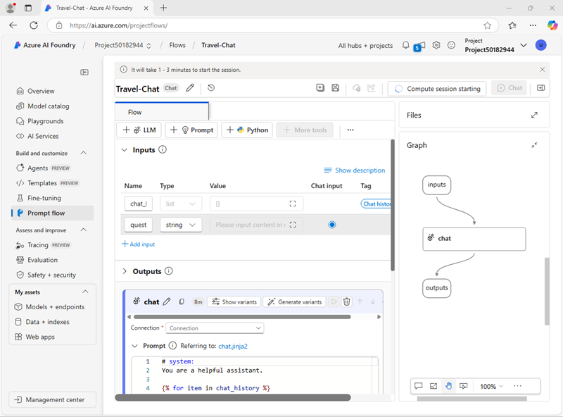
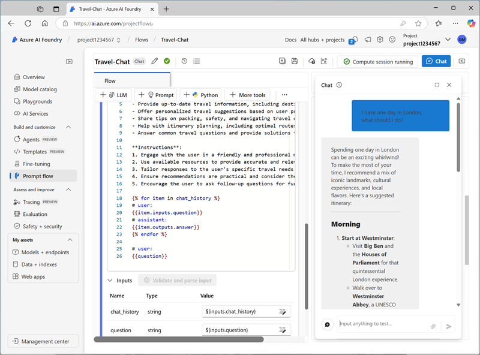
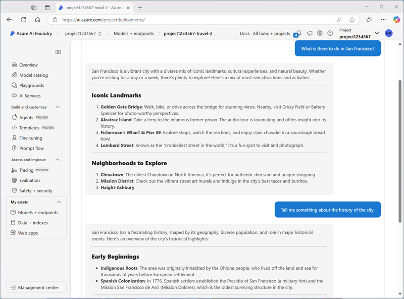

---
lab:
  title: プロンプト フローを使用してチャット アプリの会話を管理する
  description: プロンプト フローを使用して会話を管理し、最適な結果が得られるようにプロンプトが確実に作成および調整されるようにする方法について説明します。
---

## プロンプト フローを使用してチャット アプリの会話を管理する

この演習では、Azure AI Foundry ポータルのプロンプト フローを使用して、ユーザー プロンプトとチャット履歴を入力として使用し、Azure OpenAI の GPT モデルを使用して出力を生成するカスタム チャット アプリを作成します。

この演習には約 **30** 分かかります。

> **注**: この演習で使用されるテクノロジの一部は、プレビューの段階または開発中の段階です。 予期しない動作、警告、またはエラーが発生する場合があります。

## ストレージアカウントの作成

Azure AI Foundry のプロンプト フロー ツールは、Blob Storage 内のフォルダーにプロンプト フローを定義するファイルベースのアセットを作成します。 プロンプト フローを調べる前に、データストアとしてのBLOBコンテナーをまず作成します。

1. Azure Portalの検索ボックスを使用して **ストレージアカウント** を検索して選択します。
2. **ストレージセンター** の画面に遷移したら、 **[+ 作成]** のボタンをクリックして以下の設定内容でストレージアカウントを新規に作成します。
   - サブスクリプション: ドロップダウンリストから選択可能なサブスクリプション
   - リソースグループ: ドロップダウンリストから選択可能なリソースグループ
   - ストレージアカウント: グローバルに一意な任意の名称（既に使用されていますの警告が出る場合は名称の変更が必要）
   - リージョン: (US) East US
   - パフォーマンス: Standard
   - 冗長性: ローカル冗長ストレージ(LRS)
3. 設定が完了したら、 **[レビューと作成]** をクリックしてストレージアカウントの作成が完了するまで待ちます。

## リソース承認の構成

Blob Storage 内のフォルダーにプロンプト フローを定義するファイルベースの資産を作成するために、BLOBコンテナーへの読み取りに必要なアクセス権をAzure AI Foundry リソースに設定します。

1. Azure Portalのトップページ中央にあるリソースグループの項目をクリックして、Azure AI ハブ リソースを作成したリソース グループを表示します。
1. ハブの **Azure AI Foundry** リソースを選択して開きます。 次に、**[リソース管理]** セクションを展開し、**[ID]** ページを選択します。

    ![Azure portal の [Azure AI サービス ID] ページのスクリーンショット。](./media/ai-services-identity.png)

1. システム割り当て ID の状態が **[オフ]** の場合は、**[オン]** に切り替えて変更を保存します。 次に、状態の変更が確認されるまで待ちます。
1. [リソース グループ] ページに戻り、ハブの**ストレージ アカウント** リソースを選択し、その **[アクセス制御 (IAM)]** ページを表示します。

    ![Azure portal の [ストレージ アカウント アクセス制御] ページのスクリーンショット。](./media/storage-access-control.png)

1. Azure AI Foundry プロジェクトのリソースで使用されるマネージド ID の `ストレージ BLOB データ閲覧者(Storage blob data reader)` ロールにロールの割り当てを追加します。
    **[+ 追加]** のボタンをクリックして **[ロールの割り当ての追加]** を選択します。

1. ロールの割り当ての追加画面で **ストレージ BLOB データ閲覧者** を検索して選択します。

1. **[次へ]** をクリックしてメンバータブへ切り替え、**アクセスの割り当て先** を **[マネージドID]** に変更してから、 **[+ メンバーを選択する]** をクリックします。

1. **マネージドIDの選択** 画面では、サブスクリプションをドロップダウンリストから選択して、マネージドIDのリストから**Azure AI Foundry** を選択します。作成済みのAzure AI Foundryリソースが表示されるため、クリックして選択したメンバーに追加して **[選択]** ボタンをクリックします。

    ![Azure portal の [ストレージ アカウント アクセス制御] ページのスクリーンショット。](./media/assign-role-access.png)

1. **[レビューと割り当て]** をクリックしてロールの割り当てを確定させます。

1. ロールの割り当てが完了したら、Azure portal タブを閉じてAzure AI Foundry ポータルに戻ります。

## プロンプト フローを作成する

プロンプト フローを使用すると、プロンプトやその他のアクティビティを調整して、生成 AI モデルとの対話を定義できます。 この演習では、テンプレートを使用して、旅行代理店の AI アシスタントの基本的なチャット フローを作成します。

1. Azure AI Foundry ポータルのナビゲーション バーの **[ビルドとカスタマイズ]** セクションで、**[プロンプト フロー]** を選択します。
1. **[+ 作成]** のボタンをクリックして **新しいフローの作成** 画面に遷移します。 **[チャットフロー]** タイルの **[作成]** をクリックして、フォルダー名として`Travel-Chat`を指定して **[作成]** のボタンをクリックします。これにより **チャット フロー** テンプレートに基づいて新しいフローを作成します。

    単純なチャット フローが自動的に作成されます。

    > **ヒント**: アクセス許可エラーが発生した場合は、 数分待ってからもう一度やり直し、必要に応じて別のフロー名を指定します。

1. フローをテストするには、コンピューティングが必要であり、開始に時間がかかる場合があります。**[コンピューティング セッションの開始]** を選択して、既定のフローを探索して変更している間に開始させます。

1. 一連の*入力*、*出力*、および*ツール*で構成されるプロンプト フローを表示します。 左側の編集ウィンドウでこれらのオブジェクトのプロパティを展開して編集し、フロー全体をグラフとして右側に表示できます。

    

1. **[入力]** ペインを表示し、2 つの入力 (チャット履歴とユーザーの質問) があることに注意します
1. **[出力]** ペインを表示し、モデルの回答を反映する出力があることに注意します。
1. **チャット** LLM ツール ウィンドウを表示します。それには、モデルにプロンプトを送信するために必要な情報が含まれています。
1. **チャット** LLM ツール ウィンドウの **[接続]** で、AI ハブ内の Azure OpenAI サービス リソースの接続を選択します。 その後、次の接続プロパティを構成します。
    - **Api**: chat
    - **deployment_name**: *デプロイした GPT-4o モデル*
    - **[response_format]**: {"type":"text"}
1. **[プロンプト]** フィールドを次のように変更します。

   ```yml
   # system:
   **Objective**: Assist users with travel-related inquiries, offering tips, advice, and recommendations as a knowledgeable travel agent.

   **Capabilities**:
   - Provide up-to-date travel information, including destinations, accommodations, transportation, and local attractions.
   - Offer personalized travel suggestions based on user preferences, budget, and travel dates.
   - Share tips on packing, safety, and navigating travel disruptions.
   - Help with itinerary planning, including optimal routes and must-see landmarks.
   - Answer common travel questions and provide solutions to potential travel issues.

   **Instructions**:
   1. Engage with the user in a friendly and professional manner, as a travel agent would.
   2. Use available resources to provide accurate and relevant travel information.
   3. Tailor responses to the user's specific travel needs and interests.
   4. Ensure recommendations are practical and consider the user's safety and comfort.
   5. Encourage the user to ask follow-up questions for further assistance.

   
   # user:
   {{item.inputs.question}}
   # assistant:
   {{item.outputs.answer}}
   

   # user:
   {{question}}
   ```

    追加したプロンプトを読んで、それを熟知します。 これは、システム メッセージ (目的、機能の定義、およびいくつかの指示を含む) とチャット履歴 (各ユーザーの質問入力と以前のアシスタントの回答出力を表示するように並べ替え済) で構成されます。

1. **チャット** LLM ツールの **[入力]** セクション (プロンプトの下) で、次の変数が設定されていることを確認します。
    - **question** (string): ${inputs.question}
    - **chat_history** (string): ${inputs.chat_history}

1. 変更をフローに保存します。

    > **注**: この演習では、単純なチャット フローに従いますが、プロンプト フロー エディターには、フローに追加できる他の多くのツールが含まれており、会話を調整するための複雑なロジックを作成できることに注意してください。

## フローをテストする

これでフローの開発が完了したので、チャット ウィンドウを使用してフローをテストできます。

1. コンピューティング セッションが実行されていることを確認します。 実行されていなければ、開始されるのを待ちます。
1. ツール バーで、**[チャット]** を選択して **[チャット]** ペインを開き、チャットが初期化されるのを待ちます。
1. `I have one day in London, what should I do?` というクエリを入力し、出力を確認します。 [チャット] ペインは次のように表示されるはずです。

    

## フローをデプロイする

作成したフローの動作に満足したら、フローをデプロイすることができます。

> **注**: デプロイには時間がかかる場合があり、サブスクリプションまたはテナントの容量の制約の影響を受ける可能性があります。

1. ツール バーで、**[デプロイ]** を選択して、以下の設定でフローをデプロイします。
    - **基本設定**:
        - **エンドポイント**:新規
        - **[エンドポイント名]**:*一意の名前を入力*
        - **デプロイ名**:*一意の名前を入力*
        - **仮想マシン**:Standard_DS3_v2
        - **[インスタンス数]**: 1
        - **[推論データ収集]**: 無効
    - **[詳細設定]**:
        - 既定の設定を使用します**
1. Azure AI Foundry ポータルのナビゲーション ウィンドウの **[マイ アセット]** セクションで、**[モデル + エンドポイント]** ページを選択します。

    GPT-4o モデルのページが開いた場合は、その **[戻る]** ボタンを使用して、すべてのモデルとエンドポイントを表示します。

1. 最初は、このページにモデルのデプロイのみが表示される場合があります。 デプロイが一覧表示され、正常に作成されるには時間がかかる場合があります。
1. デプロイが*成功*したら、それを選択します。 次に、**[テスト]** ページを表示します。

    > **ヒント**: テスト ページでエンドポイントが異常と表示されている場合は、**モデルとエンドポイント**に戻り、少し待ってからビューを更新し、エンドポイントをもう一度選択します。

1. プロンプト「`What is there to do in San Francisco?`」を入力し、その応答を確認します。
1. プロンプト「`Tell me something about the history of the city.`」を入力し、その応答を確認します。

    テスト ペインは次のように表示されるはずです。

    

1. エンドポイントの **[使用]** ページを表示し、エンドポイントのクライアント アプリケーションの構築に使用することができる接続情報とサンプル コードが含まれていることに注意してください。これにより、このプロンプト フロー ソリューションを生成 AI アプリケーションとしてアプリケーションに統合することができます。

## クリーンアップ

プロンプト フローを調べ終わったら、不要な Azure のコストを避けるため、作成したリソースを削除する必要があります。

- [Azure portal](https://portal.azure.com) (`https://portal.azure.com`) に移動します。
- Azure portal の **[ホーム]** ページで、**[リソース グループ]** を選択します。
- この演習のために作成したリソース グループを選びます。
- リソース グループの **[概要]** ページの上部で、**[リソース グループの削除]** を選択します。
- リソース グループ名を入力して、削除することを確認し、**[削除]** を選択します。
